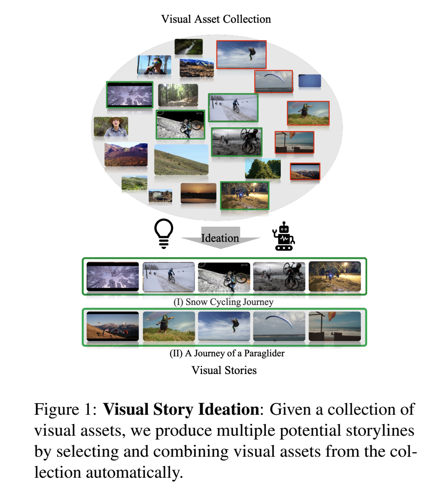
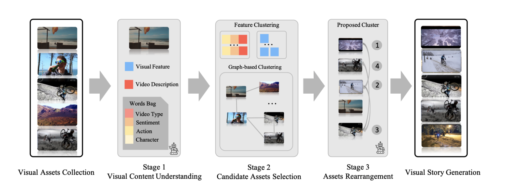
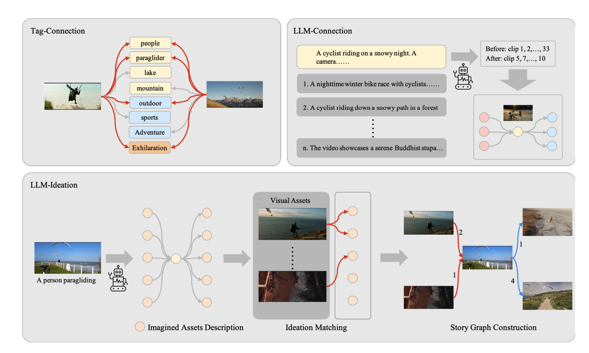
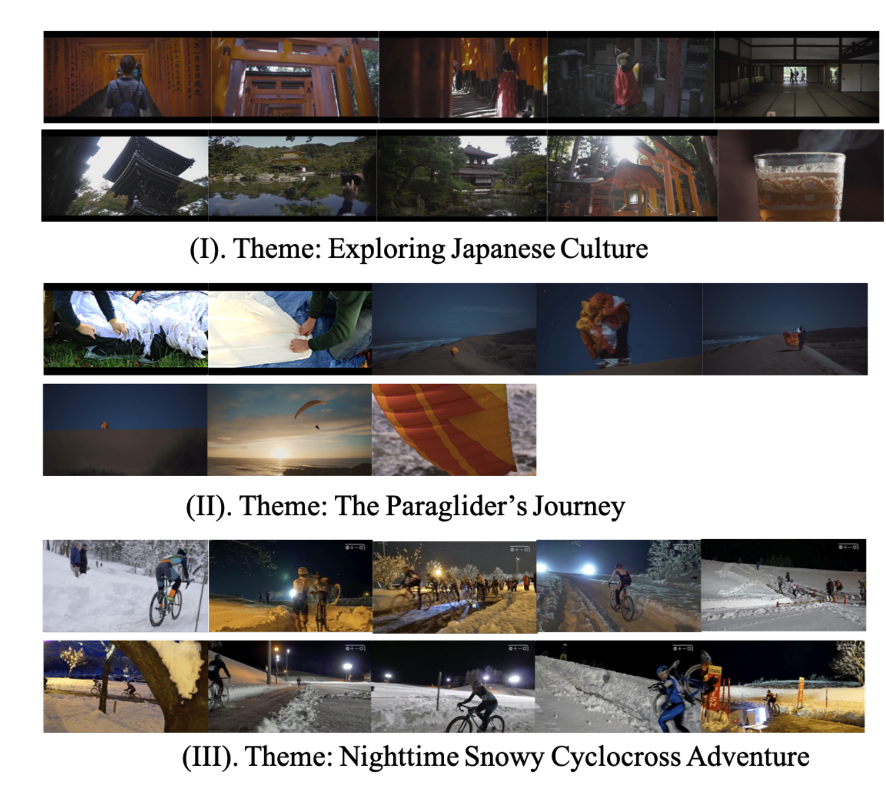
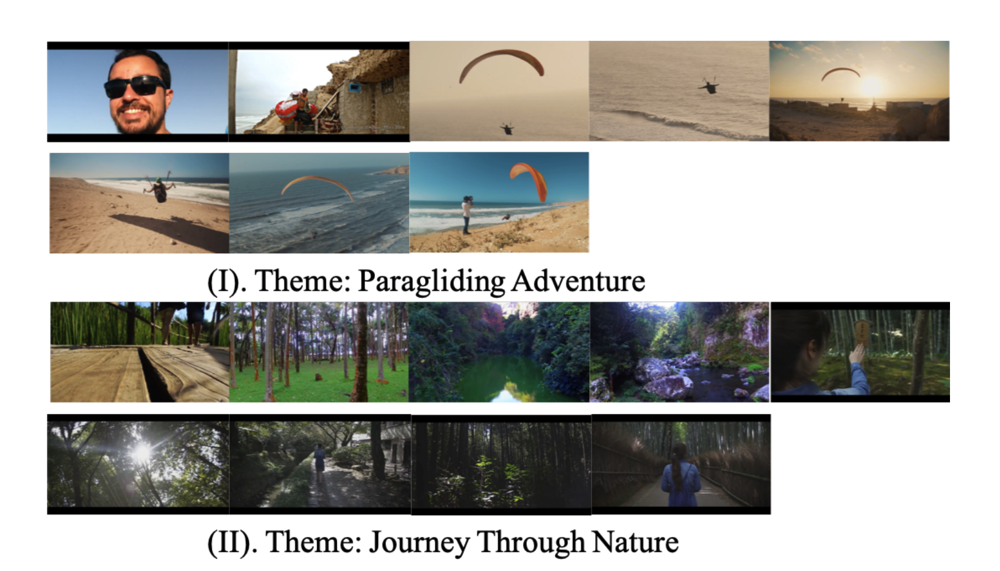

# VISIAR

This is the project website for the paper: VISIAR: Empower MLLM for Visual Story Ideation. 

In this project, we propose a novel task: Visual story ideation: automated selection and arrangement of visual assets into coherent sequences that convey expressive storylines!

Our paper has been accepted to ACL 2025! (Findings)
Check our paper for more details: [paper](https://aclanthology.org/2025.findings-acl.945/)  [PDF](https://aclanthology.org/2025.findings-acl.945.pdf)

## Introduction:
Ideation, the process of forming ideas from concepts, is a big part of the content creation process. However, the noble goal of helping visual content creators by suggesting meaningful sequences of visual assets from a limited collection is challenging. It requires a nuanced understanding of visual assets and the integration of open-world knowledge to support creative exploration. Despite its importance, this task has yet to be explored fully in existing literature. To fill this gap, we propose Visual Story Ideation, a novel and underexplored task focused on the automated selection and arrangement of visual assets into coherent sequences that convey expressive storylines.

We also present VISIAR, Visual Ideation through Sequence Integration and Asset Rearrangement, a robust framework leveraging Multimodal Large Language Models (MLLMs), and a novel Story Graph mechanism. Our framework operates in three key stages: visual content understanding, candidate asset selection, and asset rearrangement via MLLMs. In addition, we curated a new benchmark dataset, called VTravel, to evaluate our methods both qualitatively and quantitatively.

User studies and GPT-as-the-judge evaluation show that our approach surpasses GPT-4o based baseline by an average of 33.5% and 18.5% across three different metrics, demonstrating the effectiveness of our framework for generating compelling visual stories.

## Method
We propose a novel framework, VISIAR, for this task. 

We introduce a novel story graph construction method to build the graph through drawing connections between visual assets, which helps us cluster the visual assets based on story-aware connections.

## Results

We show part of our results here. For more details, please refer to our paper!

## Resources:
Our dataset is currently under review. We will provide further updates once the review is completed!

